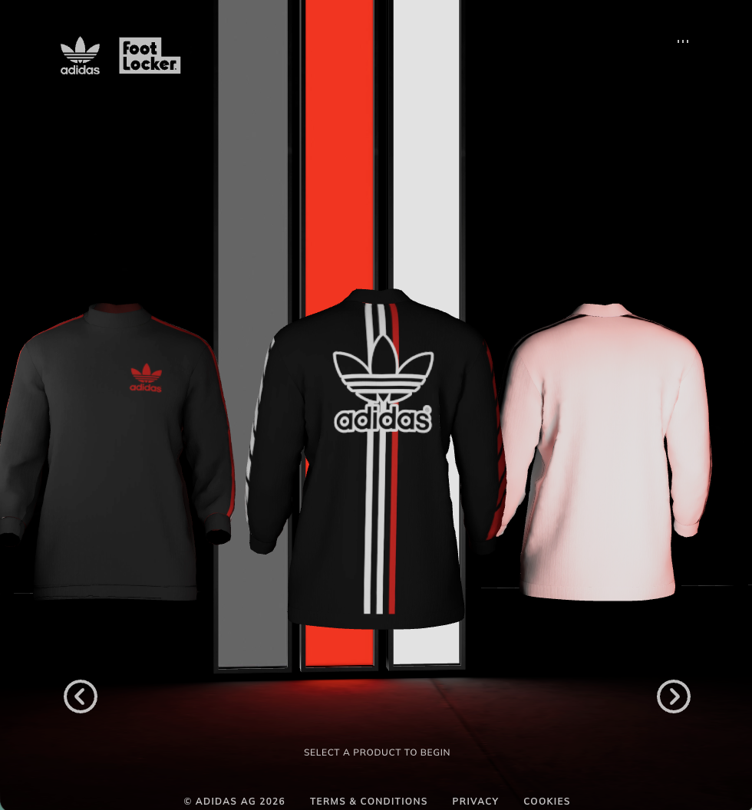
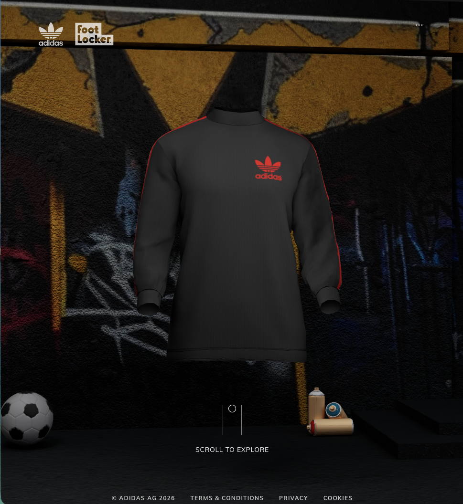
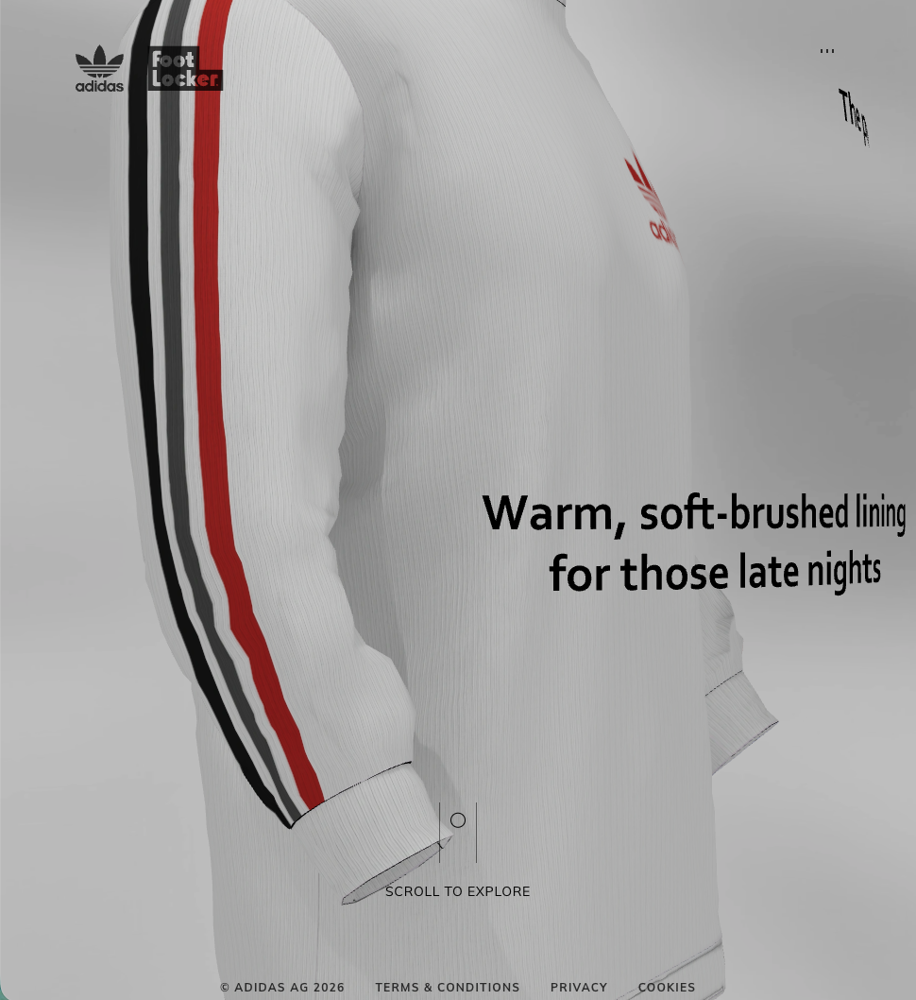
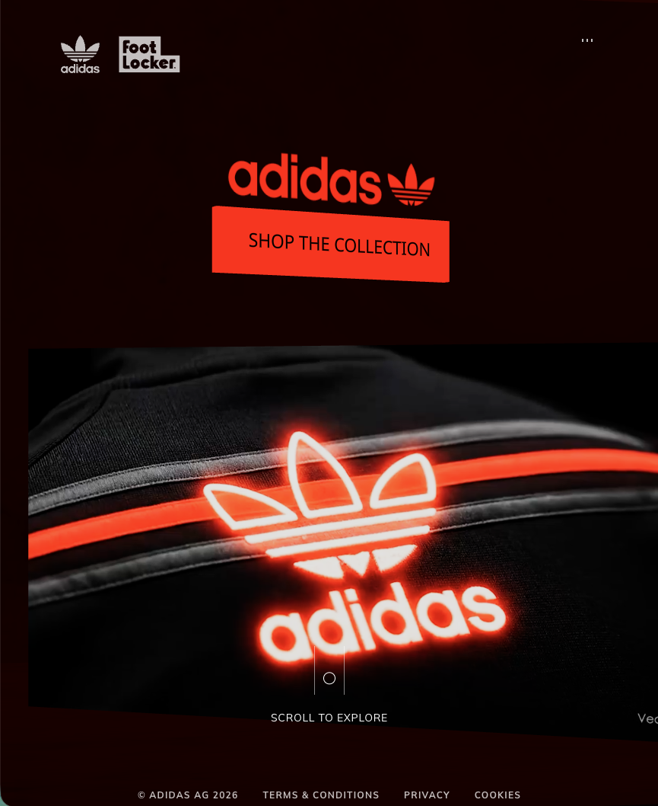
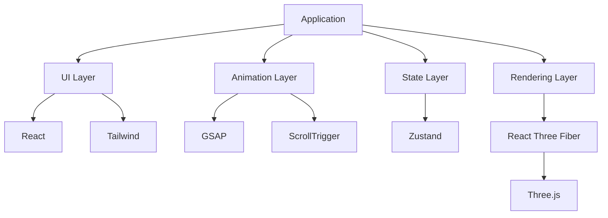
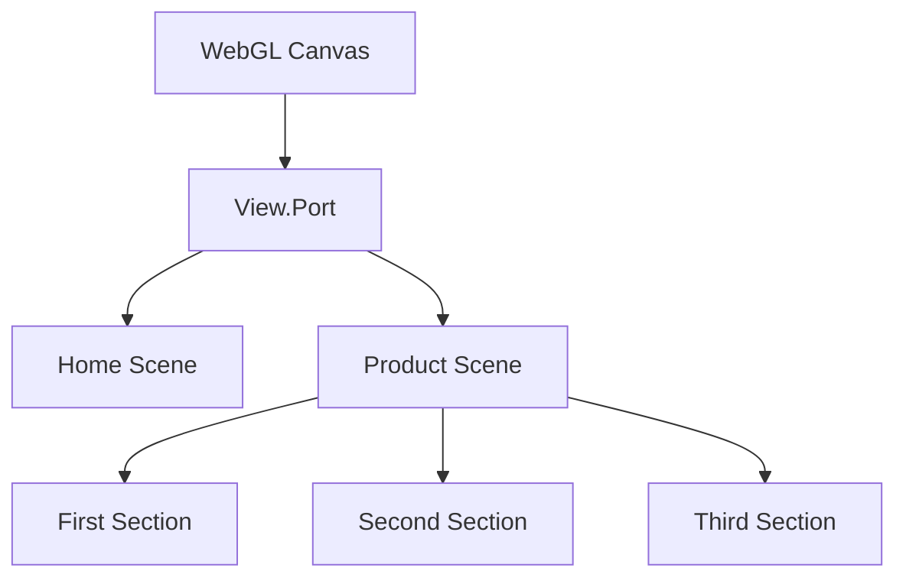

# Adidas 3D Interactive Experience


An immersive **3D WebGL product showcase** inspired by modern Adidas-style product experiences.

This project recreates a **cinematic product page** where users can explore Adidas shirts in an interactive 3D environment with scroll-driven animations, camera movement, and dynamic navigation.

The goal of this project is to demonstrate **modern WebGL architecture for the web**, combining React, Three.js, and animation libraries to build a performant interactive experience.

The project is inspired by a tutorial created by **Ali Sanati Dev** and expanded with a modular architecture and performance optimizations.

---

# Live Demo

Example deployment: https://r3f-awwwards-adidas.vercel.app/

---

# Preview

<p align="center" width="100%">





</p>

---

Recommended preview sections:

- Home studio scene
- Scroll animation interaction
- Product camera movement
- Product switching

---

# Key Features

| Feature                    | Description                                 |
| -------------------------- | ------------------------------------------- |
| Interactive 3D Studio      | Explore products inside a WebGL environment |
| Scroll-Driven Animations   | GSAP ScrollTrigger based scene transitions  |
| Cinematic Camera           | Camera reacts smoothly to cursor movement   |
| Multi-Product Navigation   | Switch between multiple shirts              |
| Responsive 3D Scene        | Automatic scaling for mobile and desktop    |
| Audio Interaction          | Music toggle with animated visualizer       |
| Optimized Asset Loading    | Texture preloading and lazy loading         |
| High Performance Rendering | Baked lighting and optimized materials      |

---

# Tech Stack

## Core Framework

- Next.js
- React
- TypeScript

## 3D Rendering

- Three.js
- React Three Fiber

## Animation

- GSAP
- ScrollTrigger

## State Management

- Zustand

## Styling

- Tailwind CSS

## Utilities

- Maath (camera smoothing)
- React Responsive
- React-Three-Drei

---

# Application Architecture

The project uses a **single WebGL canvas architecture** to improve performance and avoid multiple GPU contexts.

## Application Architecture



This separation allows UI logic, animation, and rendering to remain independent.

---

# WebGL Rendering Structure

The entire application uses **one shared canvas**.



This prevents expensive WebGL context creation and improves performance.

---

# 3D Asset Pipeline

The project uses an optimized **3D asset workflow**.

### 1. Lighting

Lighting is **baked into textures** to reduce runtime calculations.

### 2. Export

Assets are exported as: .glb

### 3. Conversion

Models are converted into React components using: https://github.com/pmndrs/gltfjsx

### 5. Rendering

The assets are rendered using **React Three Fiber** with baked materials.

This allows the use of lightweight materials such as: MeshBasicMaterial

MeshBasicMaterial

which significantly improves rendering performance.

---

# Scene Design

Each product page includes three sections:

- Section 1: Product introduction scene

- Section 2: Product showcase environment

- Section 3: Interactive environment scene

Each section contains different camera positions and animations.

---

# Animation System

Animations are powered by **GSAP timelines**.

Examples:

- scroll driven product animations
- UI transitions
- camera movements
- hover effects
- audio visualizer animation

---

### Baked Lighting

Lighting is pre-computed in Blender.

### Texture Preloading

Important assets are preloaded before rendering.

### Single WebGL Context

Using one canvas avoids multiple GPU contexts.

### React Suspense

Suspense handles asynchronous asset loading.

---

# Installation

1. Clone the repository:
   ```bash
   git clone https://github.com/delafuentej/r3f_awwwards-adidas.git
   ```
2. Navigate to the project directory:
   ```bash
   cd r3f_awwwards-adidas
   ``
   ```
3. Install dependencies:

   ```bash
   npm install
   ```

   or

   ```bash
    yarn install
   ```

4. Start the development server:
   ```bash
   npm run dev
   ```
   or
   ```bash
   yarn dev
   ```

---

# Credits

Original tutorial and inspiration by:

Ali Sanati Dev

YouTube tutorial:

https://www.youtube.com/watch?v=NNtAI6EOiSo

---

# License

This project is intended for **educational and portfolio purposes**.

All Adidas related assets and trademarks belong to their respective owners.

---

# Author

delafuentej

GitHub  
https://github.com/delafuentej
